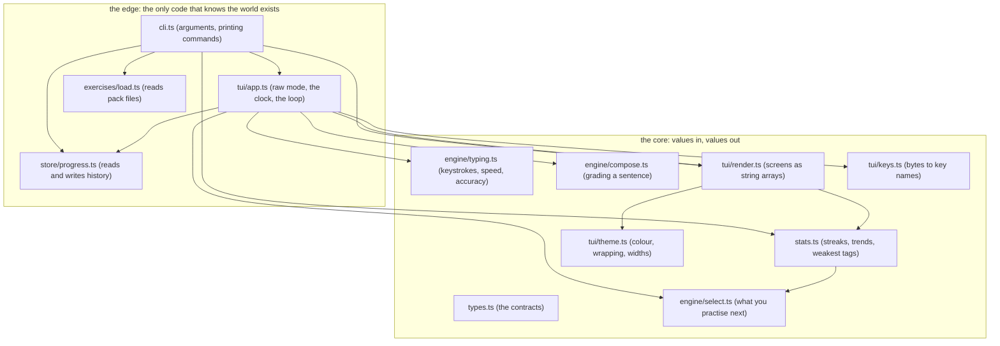
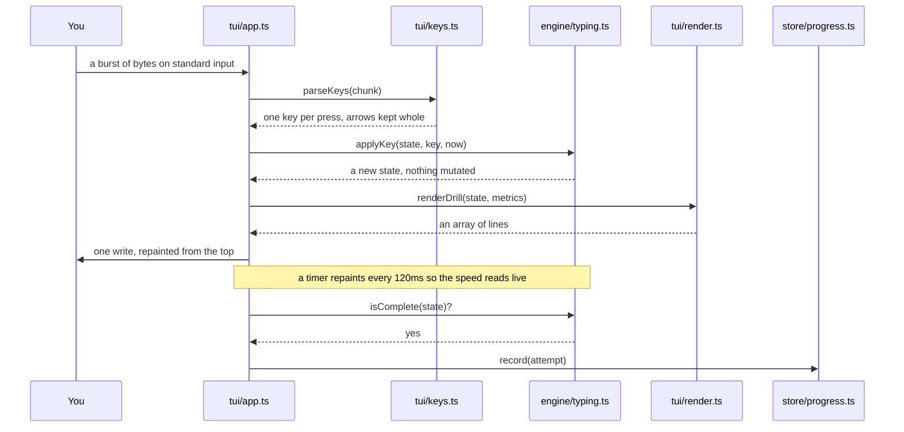
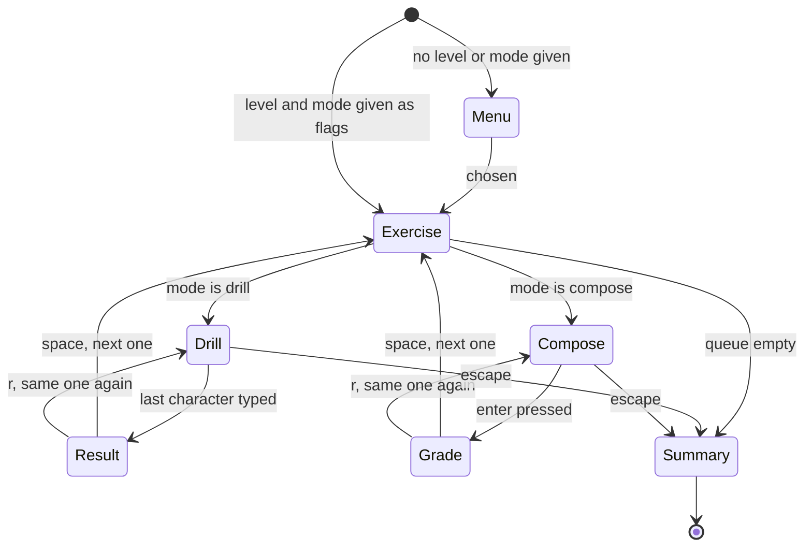
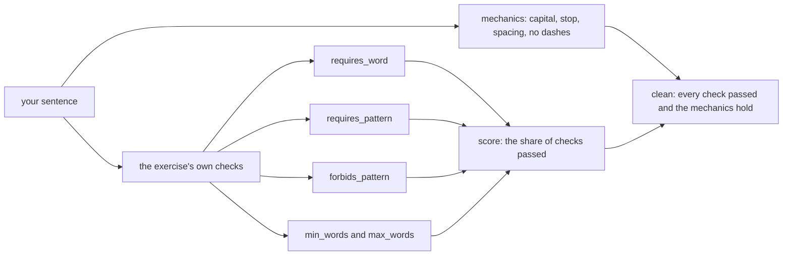
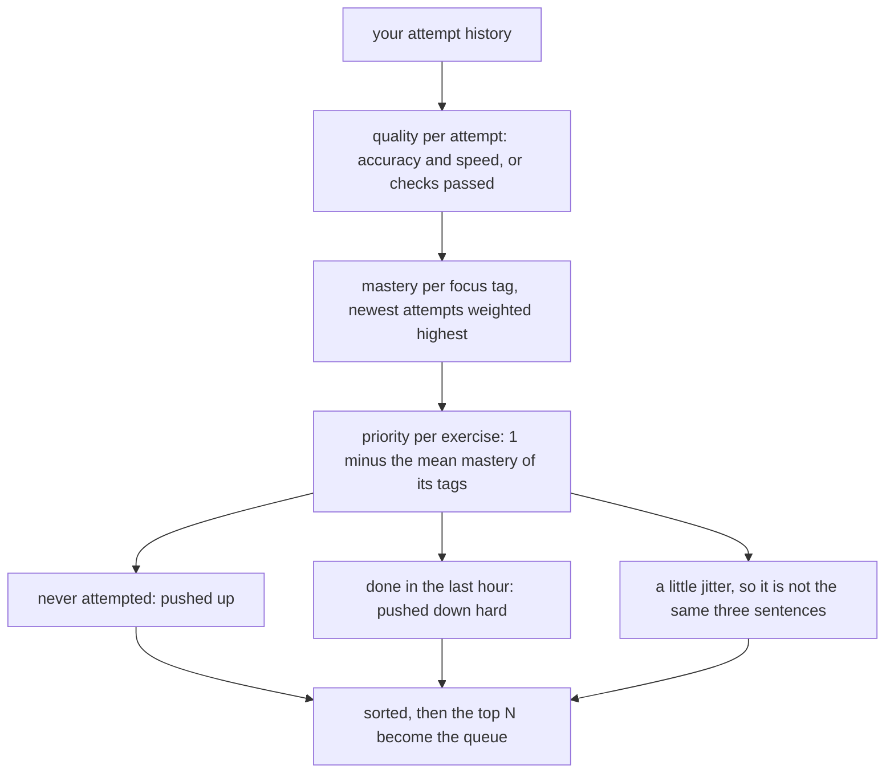
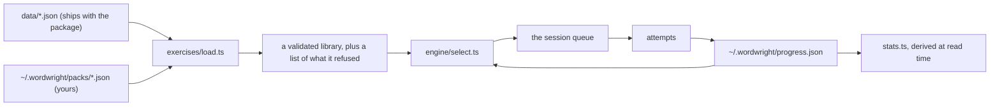

# Architecture

Three files in this repository touch the outside world. Everything else is a function from
values to values, which is the only reason a typing trainer, a thing made entirely of
keystrokes and clocks, has a test suite that runs in under a tenth of a second.

That is the whole design. The rest of this document is where the line sits and what it
buys.

## The shape

Nothing in the core imports `node:anything`. No renderer writes to standard output, no
grader reads a file, and every function that cares what time it is takes the time as an
argument. `tui/app.ts` owns the terminal, the clock and the loop, and it is the one file
you cannot unit test.

## A drill, from keystroke to stored attempt

Typing fast means several characters arrive in one chunk, and an arrow key arrives as
three bytes that must not be read as somebody typing a bracket. That is why parsing is its
own pure function: a test can drive an entire session without a terminal.

## The session loop

Retrying does not move the queue on, and the attempt you already finished is still
recorded. It happened, so it counts.

## How a composed sentence is graded

The two layers are kept apart on purpose. Mechanics hold for any sentence anyone writes
and they are not what you are being scored on. The checks are the lesson, and each one
fails with a hint written as a fix rather than as a verdict.

There is no model in the loop. Every verdict is a rule sitting in a pack file, which is
what makes the feedback instant, repeatable, and available on a train.

## What you get next

A trainer that serves random sentences trains what you are already good at. This one
scores every focus tag from your history and leans towards the ones you are worst at. The
jitter and the recency penalty exist so that leaning does not turn into a punishment loop.

## Where the data lives

Progress is an append only list of attempts. Every number the tool shows, the streak, the
best speed, the worst keys, the mastery of a tag, is derived from that list when you ask
for it. There is no cached total to go stale and no migration when a new statistic is
added.

A pack that does not validate is skipped and named by `wordwright packs`. One typo costs
you one exercise, never the run.

## The boundaries, and the test that holds them

`src/boundaries.test.ts` asserts the claims this document makes, so the document cannot
quietly stop being true:

- no file in the core imports a `node:` module
- only `cli.ts`, `tui/app.ts` and the one environment variable read in `exercises/load.ts`
  touch the `process` global
- only `cli.ts` and `tui/app.ts` read the clock without being handed the time

If you move something across the line, that test fails and this page needs editing. That
is the point of it.

## Extending it

**A new exercise** is a JSON object in a pack file. No code, no release. The readme
documents the format and `wordwright template` prints a skeleton.

**A new kind of check** is three edits: the union in `types.ts`, a case in `runCheck` in
`engine/compose.ts`, and a case in `validateCheck` in `exercises/load.ts`. TypeScript will
name all three for you if you add the variant first, because every switch over the union
is exhaustive.

**A new screen** is a function in `tui/render.ts` returning `string[]`, and a call in
`tui/app.ts`. Renderers take a `Frame` carrying the width and a `plain` flag, so every
screen has a colourless twin that a test can assert on.

**A new statistic** is a function in `stats.ts` over the attempt list. Nothing is stored,
so nothing needs migrating.

## Known rough edges

`store/progress.ts` imports `homeDir` from `exercises/load.ts`, which puts a path concern
in the wrong module and makes the store depend on the loader for no good reason. It works
and it is one function, so it has not been worth a change yet. If a third module ever
needs that path, it should move somewhere of its own.

The compose grader matches patterns, so it can be satisfied by a sentence that obeys the
letter of the exercise and means nothing. It catches the mistakes you repeat. It cannot
tell you the sentence is good.
